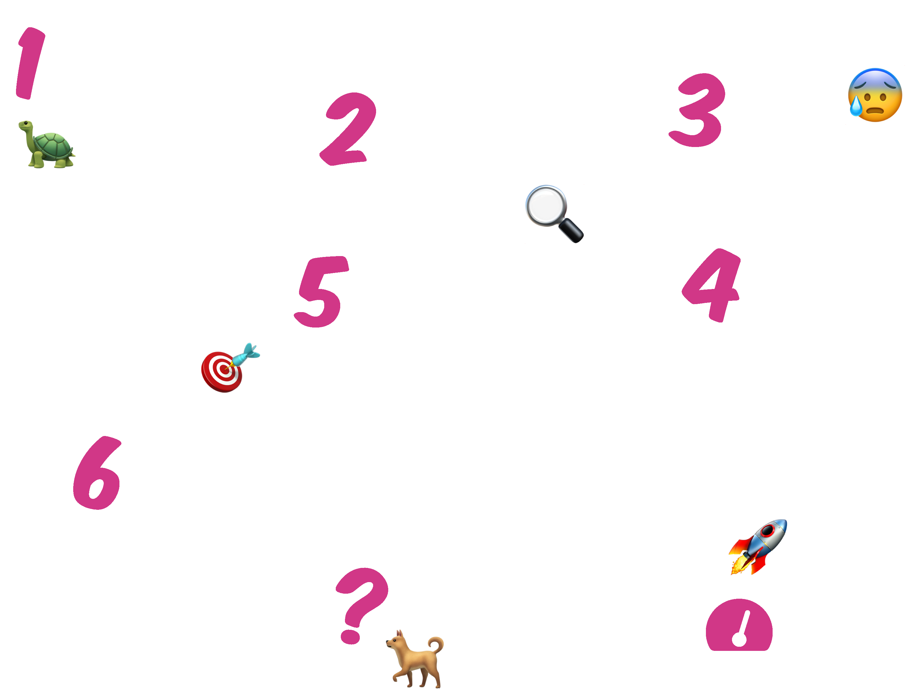
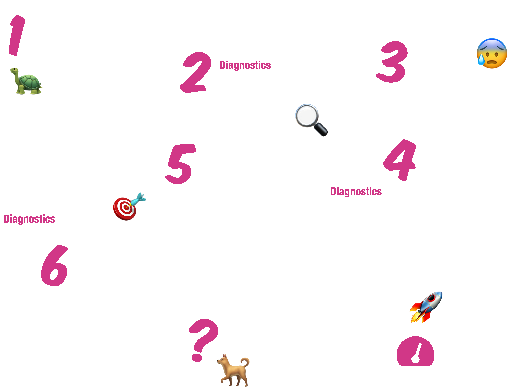
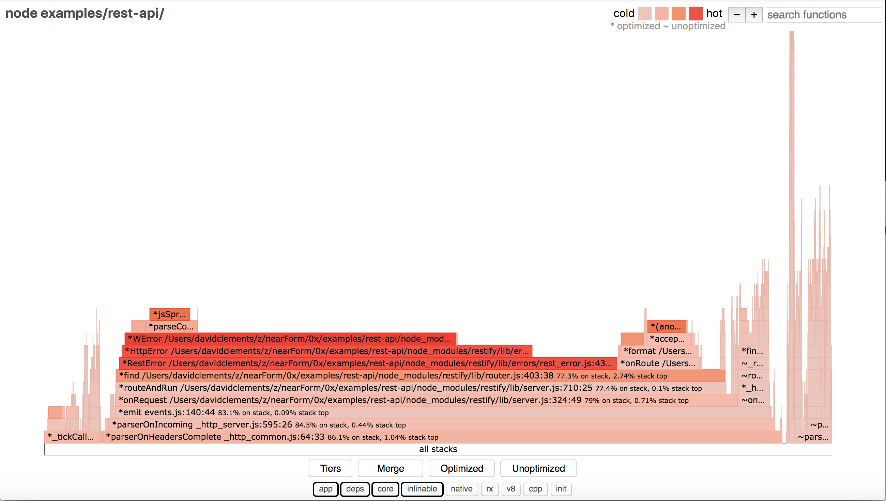
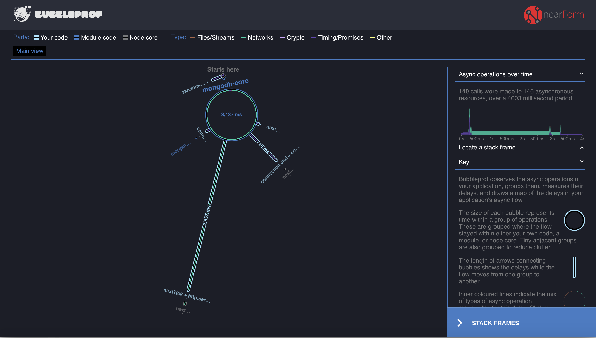

title: A new way to profile Node.js
layout: true
class: no-counter
<!-- This slide will serve as the base layout for all your slides -->
.bottom-bar[
  <a style="float:left;filter:invert(.5)" href="http://nearform.com"></a>
  <div style='float:right;margin-top:.6em;letter-spacing:.03em'>
    <div style='font-size:0.6em;line-height:1.2em'>
      <a href=https://twitter.com/matteocollina>
        <span class=em>@</span>matteocollina 
      </a>
    </div>
    <div style='font-size:0.6em;line-height:1.1em'>
      <a href=https://twitter.com/davidmarkclem>
        <span class=em>@</span>davidmarkclem
      </a>
    </div>
  </div>
]

---
class: splash
<p style='margin-top:-1em'></p>
# &nbsp;&thinsp;A .em[NEW] WAY <br>TO PROFILE<br> NODE.em[.]JS

<span>Matteo Collina</span>
<span class=em> & </span>
<span>David Mark Clements</span>
<a style="border-top:2px solid #d13787;filter:invert(.125);display:block;width:10em;margin-left:auto;margin-right:auto;padding-top:.4em;margin-top:1.7em;margin-bottom:-2.5em" href="http://nearform.com"></a>

---

class: impact 

# Performance


---

class: impact, perfromance

# Perf.em[r]omance

---

class: impact

# Don't it always seem to go...


---

class: impact

# That you don't know what you got

---

class: impact

# Till it's gone
---

class: impact

# .blink-2[🚨]
## .blink-1[MAXIMUM NUMBER OF SERVERS] 
## .blink-1[SALES TRAFFIC DROPPING]
## .blink-1[ANGRY PEOPLE ARE ANGRY]

---

class: impact

# .em[Why] is it slow?

---

class: impact

# because .em[bottleneck]

---

class: impact

# Why is it slow?

<p style='padding: .1em'></p>
.col-5[
## The bottleneck is .em[internal]
<br>
## The Node.js process
## is on fire
]

.col-2[
## .center[|]
## .center[|]
## .center[|]
## .center[|]
## .center[|]
]

.col-5[
## The bottleneck is .em[external]
<br>
## Something else
## is on fire
]

---

class: impact

# .em[Where] is the bottleneck?

---

# Finding Bottlenecks

.center[.responsive-v[]]


---

# Simulating Load

<div class=logo style='background:rgb(127,127,127);margin-bottom:-1em;height:3.9em;margin-top:0.95em;border: 2px solid #d13787;box-sizing:border-box'>
  .autocannon[]
</div>


.responsive[]

---

# Finding Bottlenecks

.center[.responsive-v[]]

---

# Diagnostics

[.throb[.center[]]](http://github.com/nearform/node-clinic)


```sh
$ npm i -g clinic
```

---

<a href=http://github.com/nearform/node-clinic style="position:absolute;left:0;top:.5em;width:100%;">
.center[.clinic[]] 
</a>
<p style="margin-top: 5.5em"></p>


.col-4[
<a href=http://github.com/nearform/node-clinic-doctor>
.logo[]
## Clinic Doctor 
</a>
]

.col-4[
<span>
.logo[] 
## Clinic Bubbleprof 
</span>
]

.col-4[
<a href=http://github.com/davidmarkclements/0x>
.logo[]
## Clinic Flame 
</a>
]


---

class: impact

# Clinic Doctor
<a href=http://github.com/nearform/node-clinic-doctor>
.logo[]
</a>

<h2 style="width: 28.5rem;margin: 0 auto;margin-top: -.5em"> 
Applies .em[heuristics] <br>to assess the .em[health] of a Node.js process under .em[load] 
</h2>


---

class: impact

# Clinic Flame
.logo[]
## Collects data by .em[CPU sampling]
## Tracks .em[top-of-stack] frequency
## Creates .em[flame graphs]


---

# .em[Flame] graphs

.center[.responsive-v[]]


---

class: impact

# Clinic Bubbleprof

.logo[]

## Collects data using .em[async_hooks]
## Tracks .em[latency] between operations
## Creates .em[bubble graphs]

---

# Bubble graphs

.center[.responsive-v[]]


---

class: impact

<a href=http://github.com/nearform/node-clinic-doctor>
.logo[]
</a>
# .em[Where] is the bottleneck?

---

<p style="margin-top:-2em"></p>
<p style="padding:.1em"></p>
.col-5[
## Clinic Flame
.logo[]
## For .em[internal] bottlenecks

]

.col-2[
## .center[|]
## .center[|]
## .center[|]
## .center[|]
## .center[|]
]

.col-5[
## Clinic Bubbleprof
.logo[]
## For .em[external] bottlenecks
]


---

class: impact

# .em[Live] Hack

.col-4[
<a href=http://github.com/nearform/node-clinic-doctor>
.logo[]
</a>
]

.col-4[
<span>
.logo[] 
</span>
]

.col-4[
<a href=http://github.com/davidmarkclements/0x>
.logo[]
</a>
]


---

.center[
  
]


---

class: impact

<h1 style='margin-top:-0.25em'>The .em[Team]</h1>

.team[]

---

class: impact

# Parting Words

---

# Set quantifiable performance goals

> The application should have a response time of 200ms or less in the 99th percentile at 100 concurrent requests per server.


---

# Beware of the rabbit hole

* It is not uncommon for .em[80%] of effort to be in the final .em[20%] of optimization work
* Find out what .em[fast enough] is for your given business context
* Remember to .em[balance the cost] of your time against savings and other business gains

---

class: impact

<p style='margin-top:-2.25em'></p>

# .small[Choose fast libraries]

<p style='padding:.1em'></p>

.col-5[
## Pino
<a href='http://getpino.io'>
.logo[]
</a>
## High speed .em[logging] library
]

.col-2[
## .center[|]
## .center[|]
## .center[|]
## .center[|]
## .center[|]
]

.col-5[
## Fastify
<a href='http://fastify.io'>
.logo[]
</a>
## High speed .em[web] framework
]


---
class: splash

# .em[Talk] to us!
## [.em[@]matteocollina](https://twitter.com/matteocollina) 
## [.em[@]davidmarkclem](https://twitter.com/davidmarkclem)
<span>Matteo Collina</span>
<span class=em> & </span>
<span>David Mark Clements</span>
<a style="filter:invert(.125);display:block;width:10em;margin-left:auto;margin-right:auto;padding-top:.8em;margin-top:3.2em;margin-bottom:-2.5em" href="http://nearform.com"></a>
